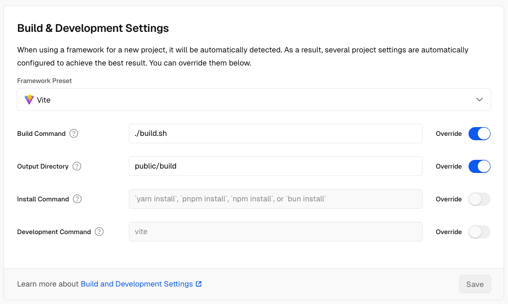

# Statamic on Vercel 
This is a Statamic v5.35 and build.sh file that compiles and pushes static files on Vercel.

The guide I read on [Statamic's Blog](https://statamic.dev/deploying/vercel) needs to be fixed, and I found a way to fix this.

## Guide 
1. Download this repository (or the latest version of Statamic)
2. Follow their guide to install Statamic
3. Copy build.sh into the root folder
4. Push the repo on Github
5. Link Github repo to Vercel project 
6. Setup Vercel (see the image below)
7. sh build.sh to compile
8. Push to Github

Here a working demo: https://blog-rho-lovat-83.vercel.app/

### Setup Vercel

